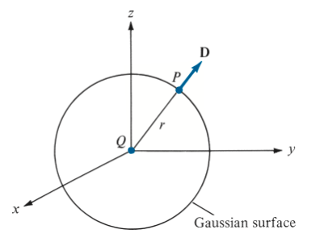
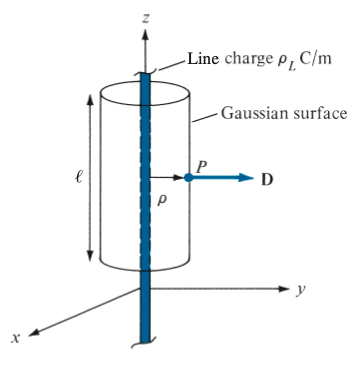
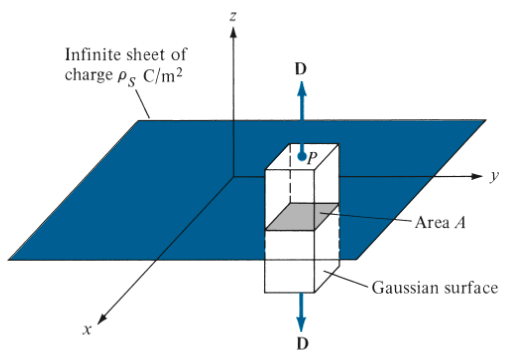

# gauss-law

Gauss's law in Maxwell's Equations

> The total electric flux  through any closed surface is equal to the total charge enclosed by that surface

Based on the definition of 

the total charge enclosed Q can be computed using the volume charge density 

## Two forms of Gauss's law

### The integral form of Gauss's law for electric field

### The differential form of Gauss's law for electirc field

Applying the divergence theorem to the definition of 

Comparing with the integral form of Gauss's law, we can get its differential form

## Applications of Gauss's law

Finding the vector fields,  or , by construting a proporate Gaussian surface.

> The ability to take  out of the integral sign

### Point Charge

A point charge Q is located at the origin, to determine  at point P.

With Q given, all we have to do is constructing a _symmetry gaussian surface_, which makes the integral easy to solve.

### Infinite Line Charge

An infinite line of charge  lies along the z-axis, to determine  at point P.

First we have to determin the Q, in this problem, we can take a segement  of the infinite line.

For each element charge  on segement , it generates a  which can be separated into a z-component and a -component. A cooresponding element charge  exists, and the z-components of  and  cancels, resulting only -components exist.

### Infinite Sheet of Charge

An infinite sheet of uniform charge  lies con the xy-plane, to determine  at point P.

For each element charge , it generates a , which can be separated into a z-component, a x-component, and a y-component. A coorespoding element charge  exists. The x-components and y-components of  and  cancel each other, resulting only z-components exists.

### Uniformly Charged Sphere

A sphere of radius  with a uniform charge , to determine  at point P.

For 

For 

 stays the same.
