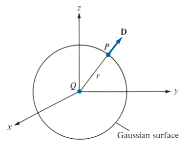
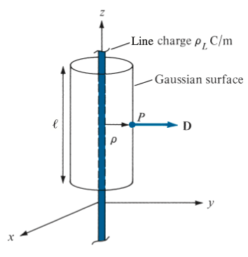
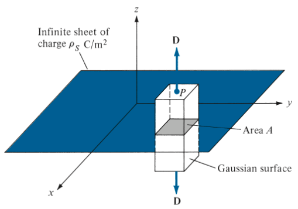

# gauss-law

Gauss's law in Maxwell's Equations

> The total electric flux $\Psi$ through any closed surface is equal to the total charge enclosed by that surface

$$
\Psi = Q_{enc}
$$

Based on the definition of $\Psi$

$$
\Psi = \int_S \mathbf{D} \cdot d\mathbf{S}
$$

the total charge enclosed Q can be computed using the volume charge density $\rho_v$

$$
Q = \int_V \rho_v dv
$$

## Two forms of Gauss's law

### The integral form of Gauss's law for electric field

$$
\int_S \mathbf{D} \cdot d\mathbf{S} = \int_V \rho_v dv
$$

### The differential form of Gauss's law for electirc field

Applying the divergence theorem to the definition of $\Psi$

$$
\Psi = \int_S \mathbf{D} \cdot d\mathbf{S} = \int_V \nabla \cdot \mathbf{D} dv
$$

Comparing with the integral form of Gauss's law, we can get its differential form

$$
\rho_v = \nabla \cdot \mathbf{D}
$$

## Applications of Gauss's law

Finding the vector fields, $\mathbf{E}$ or $\mathbf{D}$, by construting a proporate Gaussian surface.

> The ability to take $\mathbf{D}$ out of the integral sign

### Point Charge

A point charge Q is located at the origin, to determine $\mathbf{D}$ at point P.

With Q given, all we have to do is constructing a _symmetry gaussian surface_, which makes the integral easy to solve.

$$
Q = \int_S \mathbf{D} \cdot d\mathbf{S} = D_r \int_S d\mathbf{S} = D_r 4 \pi r^2
$$

### Infinite Line Charge

An infinite line of charge $\rho_L$ lies along the z-axis, to determine $\mathbf{D}$ at point P.

First we have to determin the Q, in this problem, we can take a segement $\mathcal{l}$ of the infinite line.

For each element charge $dQ_1$ on segement $\mathcal{l}$, it generates a $\mathbf{D}$ which can be separated into a z-component and a $\rho$-component. A cooresponding element charge $dQ_2$ exists, and the z-components of $dQ_1$ and $dQ_2$ cancels, resulting only $\rho$-components exist.

$$
\rho_L \mathcal{l} = Q = \int_S \mathbf{D} \cdot d\mathbf{S} = D_{\rho}\int_S d\mathbf{S} = D_{\rho}2 \pi \rho \mathcal{l}
$$

### Infinite Sheet of Charge

An infinite sheet of uniform charge $\rho_S$ lies con the xy-plane, to determine $\mathbf{D}$ at point P.

For each element charge $dQ_1$, it generates a $\mathbf{D}$, which can be separated into a z-component, a x-component, and a y-component. A coorespoding element charge $dQ_2$ exists. The x-components and y-components of $dQ_1$ and $dQ_2$ cancel each other, resulting only z-components exists.

$$
\rho_S \int_S dS = \rho_S A = Q = \int_S \mathbf{D} \cdot d\mathbf{S} = D_z\left[ \int_{top}dS + \int_{bottom}dS \right] = D_z(A + A)
$$

### Uniformly Charged Sphere

A sphere of radius $a$ with a uniform charge $\rho_o$, to determine $\mathbf{D}$ at point P.

For $r \le a$

$$
Q_{enc} = \int_v \rho_v dv = \rho_o \int_v dv = \rho_o \frac{4}{3}\pi r^3
$$

$$
\int_S \mathbf{D} \cdot d\mathbf{S} = D_r \int_S dS = D_r 4 \pi r^2
$$

For $r \ge a$

$$
Q_{enc} = \rho_o \frac{4}{3}\pi a^3
$$

$\Psi$ stays the same.
